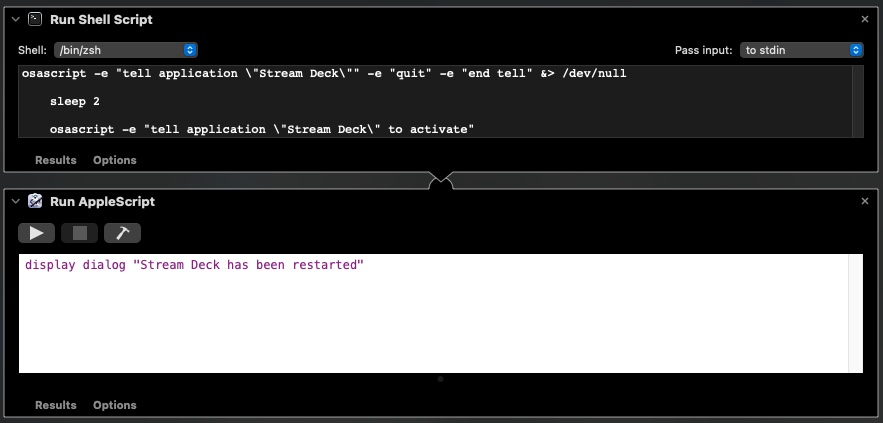

# Overview

Very simple script to restart Stream Deck

(without the need to install other scripts,
like github.com/muesli/streamdeck - that while works
would need to be installed)

# Source



## Specific Source

(Please look at the app within Mac Automator)

```
# shellscript
osascript -e "tell application \"Stream Deck\"" -e "quit" -e "end tell" &> /dev/null

sleep 2

osascript -e "tell application \"Stream Deck\" to activate"
```

```
# appleScript
display dialog "Stream Deck has been restarted"
```
